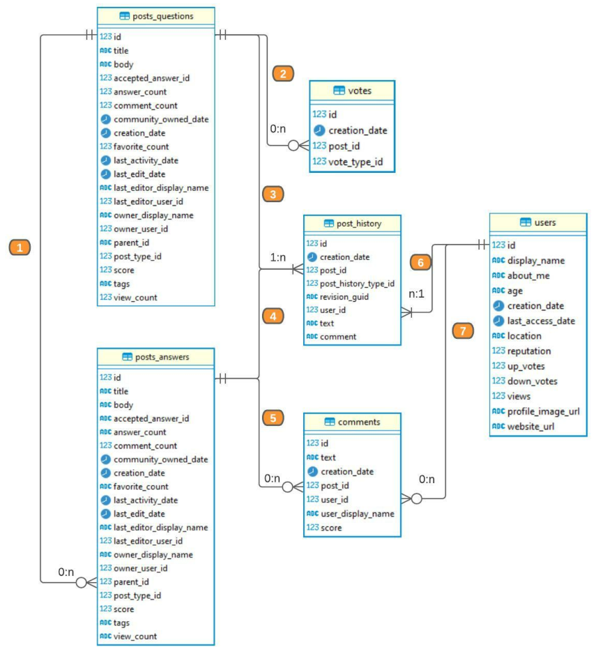

# `dbt`

## Commands

`dbt init <project name>` to create a new project.

`dbt deps` install packages from `packages.yml`. It requires `dbt_project.yml`.

`dbt build` requires `profiles.yml`. Define configuration in `profiles.yml`.

`dbt run` to materialize the models.

`dbt seed` to include static files from the `/seeds` folder.

## Simple model

Create a directory in the `models` directory. Add `.sql` files.

# Data model

# Ref

Main: https://github.com/ergest/sql_patterns/tree/main

Additional:

- https://github.com/meltano/jaffle-shop-template
- https://github.com/gwenwindflower/octocatalog
